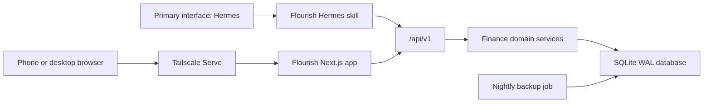

# Flourish product and implementation plan

## 1. Product outcome

Flourish is a private, locally hosted personal-finance service and mobile-first web dashboard for one person. Hermes is its primary interface. It should make three everyday jobs easy:

1. Record, import, correct, and review spending through Hermes.
2. Set monthly category budgets and see what remains before overspending.
3. Track credit cards and personal loans, then compare realistic repayment plans.

Every user-facing financial workflow must be possible through Hermes; there must be no UI-only capability. The web app is the visual review and direct-manipulation companion for charts, lists, and occasional form editing. The application has no login or user-management UI. It runs on `ubot-server`, listens only on loopback, and is exposed to the owner's devices through Tailscale.

## 2. Recommended defaults

These defaults keep the first release focused and can be changed before implementation:

- Base currency: AED.
- Time zone: Asia/Dubai.
- Budget period: calendar month.
- Budget method: category limits, with rollover disabled by default.
- Deployment: one Docker container plus one persistent SQLite volume.
- Access: application bound to `127.0.0.1`; Tailscale Serve provides tailnet-only HTTPS.
- Data entry: Hermes conversation and statement attachments first; manual web forms remain available as a fallback. No live bank integrations in v1.
- Repayment projections: avalanche, snowball, and fixed-allocation scenarios.

## 3. Scope

### First release

- Accounts for bank, cash, credit card, and personal loan balances.
- Expense, income, transfer, adjustment, and debt-payment transactions.
- Split transactions for category splits and principal/interest/fee breakdowns.
- Categories, merchants, notes, dates, and payment-account selection.
- Monthly budget setup, progress, remaining amount, and overspend warnings.
- Credit-card terms: balance, limit, APR, statement day, due day, and minimum-payment rule.
- Personal-loan terms: outstanding principal, APR, instalment, remaining term, and next due date.
- Repayment simulator with payoff date, total interest, and monthly schedule.
- Mobile-first dashboard and workflows using shadcn/ui.
- Versioned JSON API with an OpenAPI document.
- Hermes skill covering setup, capture, correction, statement upload/import, budgets, accounts, debts, payments, reports, exports, and repayment simulations.
- CSV/JSON export, SQLite backups, health checks, and structured logs.

### Deliberately deferred

- Bank account aggregation or credential storage.
- Automatic card or loan payments.
- Receipt OCR and email scraping.
- Shared households, multiple users, roles, or in-app authentication.
- Cloud sync.
- Investment, tax, net-worth, or accounting features.
- Native mobile apps and offline-first conflict resolution.
- Multi-currency budgeting. The schema should retain currency fields, but v1 calculations use one base currency.

### Interface priority rule

Hermes is the product's command surface, not an optional integration:

- Every API capability used by the web UI must have a corresponding Hermes operation.
- New user-facing features are incomplete until their Hermes conversation path is tested.
- Hermes performs setup, mutations, queries, uploads, corrections, simulations, and exports.
- The web UI optimizes scanning, comparison, charts, transaction inspection, and manual fallback.
- Host deployment and disaster recovery can remain administrator commands, but normal finance management must never require opening the web UI.

## 4. User experience

### Navigation

Use a five-item bottom bar on mobile and a compact sidebar on desktop:

- Home
- Transactions
- Budget
- Debts
- More

A persistent `+` action opens a shadcn Drawer on mobile and Dialog on desktop. The default action is “Add expense,” with income, transfer, and payment available from the same form.

### Home

The web dashboard answers “How am I doing?” without requiring interpretation. It is a visual companion to Hermes, not a required starting point:

- Spent this month and change from last month.
- Budget remaining and number of categories at risk.
- Upcoming card and loan payments.
- Total debt and projected debt-free date for the selected plan.
- Recent transactions.
- Spending by category, using a simple chart plus accessible text values.

### Transactions

- List-first layout grouped by day.
- Search and filters for date, account, category, type, and source.
- Quick add and edit in a Drawer.
- Clear distinction between an expense and a transfer so card payments are not counted as spending twice.
- Desktop can use a table; mobile uses stacked rows without horizontal scrolling.

### Budget

- Month switcher and total planned, spent, and remaining.
- Category rows with progress bars and plain states: on track, close, or over.
- Tap a category to view its transactions and adjust its limit.
- “Copy last month” for quick setup.
- Optional rollover can be added after the basic month model is proven.

### Debts

- Summary cards for every credit card and loan.
- Next payment, due date, interest rate, current balance, and utilization for cards.
- Debt detail with payment history and an editable lender snapshot.
- Plan screen with monthly amount, strategy, payoff date, total interest, and a month-by-month schedule.
- Projections must be labelled as estimates; lender fees and statement rounding can differ.

### More

- Accounts and categories.
- Recurring items.
- Import/export.
- Application settings.
- Backup status and application version.

### Mobile and accessibility rules

- Design at 390x844 first, then verify tablet and desktop layouts.
- Minimum 44px touch targets and no hover-only actions.
- Use semantic buttons, labels, validation messages, focus management, and keyboard operation.
- Keep primary actions reachable near the bottom of forms.
- Never require a wide table on mobile.
- Show both color and text/icon state for budgets and due dates.

## 5. Technical architecture

### Stack

- Node.js 22 and TypeScript.
- Next.js App Router for the UI and REST route handlers in one deployable process.
- React, Tailwind CSS, and shadcn/ui.
- Recharts for the few charts that materially help interpretation.
- Zod for input/output validation and OpenAPI generation.
- Drizzle ORM with SQLite in WAL mode.
- Vitest for domain and API tests; Playwright for real browser flows.
- pnpm for package management.

This is intentionally a single application rather than a frontend/backend microservice split. Hermes still gets a stable HTTP API, while local deployment, migrations, backups, and upgrades remain simple.



### Suggested repository layout

```text
app/
  (dashboard)/
  api/v1/
components/
  ui/                 # generated shadcn components
  finance/            # app-specific UI
lib/
  api/                # schemas and response helpers
  db/                 # schema, migrations, repositories
  domain/             # money, budgets, balances, repayments
  services/           # transaction, budget, debt orchestration
integrations/
  hermes/skills/flourish/
    SKILL.md
    scripts/flourish_api.py
    references/api.md
scripts/
  backup.sh
  restore.sh
tests/
  api/
  domain/
  e2e/
data/                 # ignored; mounted persistent volume in production
```

### Financial data rules

- Store money as integer minor units, never floating-point values.
- Store timestamps in UTC and render them in the configured time zone; spending dates and due dates remain explicit date-only values.
- Every transaction has a positive amount plus a type that defines its balance effect.
- A transfer links a source and destination account and is excluded from income/expense totals.
- A debt payment can split into principal, interest, and fees; only interest and fees count as spending.
- Adjustments are explicit records used to reconcile the ledger with a lender or bank balance.
- Soft-delete financial records and retain a local audit event for mutations.
- All create operations accept an idempotency key so Hermes retries cannot duplicate an expense or payment.
- Repayment calculations are deterministic domain functions, separate from UI and database code.

### Core entities

| Entity | Important fields |
| --- | --- |
| `settings` | base currency, time zone, month start, week start |
| `accounts` | name, type, currency, opening balance, active state |
| `credit_card_details` | account, limit, APR, statement day, due day, minimum rule |
| `loan_details` | account, APR, original/current principal, instalment, remaining term, next due date |
| `categories` | name, parent, kind, icon/color, active state |
| `transactions` | type, date, amount, account, transfer account, merchant, category, note, source, idempotency key |
| `transaction_splits` | transaction, category or debt component, amount |
| `budgets` | month, category, limit, rollover setting |
| `recurring_items` | transaction template, cadence, next date, reminder/auto-create mode |
| `import_profiles` | institution/account, file type, column or statement mappings, date/amount rules |
| `import_batches` | account, source, file type/hash, parser version, preview/applied state, totals |
| `import_rows` | batch, normalized data, match/category state, duplicate fingerprint, error |
| `audit_events` | action, entity, source, timestamp, sanitized before/after summary |

Account balances, budget progress, and debt summaries should be calculated by domain queries rather than independently editable totals. Reconciliation creates an adjustment instead of silently replacing history.

## 6. API contract

All application endpoints live under `/api/v1`. JSON uses camelCase externally and validated types internally. Errors use one consistent shape: `code`, `message`, `fieldErrors`, and `requestId`.

### System and overview

| Method | Endpoint | Purpose |
| --- | --- | --- |
| `GET` | `/api/v1/health` | Liveness, database readiness, version |
| `GET` | `/api/v1/dashboard?month=YYYY-MM` | Home summary, recent activity, due items |
| `GET` | `/api/v1/openapi.json` | Machine-readable API contract |

### Transactions and setup

| Method | Endpoint | Purpose |
| --- | --- | --- |
| `GET/PATCH` | `/api/v1/settings` | Read or update currency, time zone, and budget defaults |
| `GET/POST` | `/api/v1/transactions` | Filter/list or create a transaction |
| `GET/PATCH/DELETE` | `/api/v1/transactions/{id}` | Read, edit, or soft-delete |
| `GET/POST` | `/api/v1/accounts` | List or create accounts |
| `GET/PATCH` | `/api/v1/accounts/{id}` | Account detail and terms |
| `GET/POST` | `/api/v1/categories` | List or create categories |
| `PATCH` | `/api/v1/categories/{id}` | Rename, reorder, or archive |

### Recurring work

| Method | Endpoint | Purpose |
| --- | --- | --- |
| `GET/POST` | `/api/v1/recurring-items` | List or create recurring income, expense, transfer, or payment templates |
| `GET/PATCH/DELETE` | `/api/v1/recurring-items/{id}` | Read, update, pause, or archive a recurring item |
| `GET` | `/api/v1/upcoming` | Return upcoming recurring items and debt due dates |
| `POST` | `/api/v1/recurring-items/{id}/record` | Record the due item idempotently |

### Budgets and reports

| Method | Endpoint | Purpose |
| --- | --- | --- |
| `GET/PUT` | `/api/v1/budgets/{month}` | Read or replace month budget lines |
| `POST` | `/api/v1/budgets/{month}/copy` | Copy a prior month |
| `GET` | `/api/v1/reports/spending` | Category/account spending for a date range |
| `GET` | `/api/v1/reports/cash-flow` | Income, spending, and transfers over time |

### Debts and plans

| Method | Endpoint | Purpose |
| --- | --- | --- |
| `GET` | `/api/v1/debts` | Current card and loan summaries |
| `GET/PATCH` | `/api/v1/debts/{accountId}` | Debt detail and lender terms |
| `POST` | `/api/v1/debt-payments` | Record principal/interest/fee payment |
| `POST` | `/api/v1/repayment-plans/simulate` | Calculate a plan without writing it |
| `GET/PUT` | `/api/v1/repayment-plans/active` | Read or select the active scenario |

### Imports and portability

| Method | Endpoint | Purpose |
| --- | --- | --- |
| `POST` | `/api/v1/imports/preview` | Multipart upload and parse a CSV, XLSX, or text PDF without transaction writes |
| `GET/PATCH` | `/api/v1/imports/{id}` | Read preview or resolve account, mapping, category, and row issues |
| `POST` | `/api/v1/imports/{id}/apply` | Apply confirmed, deduplicated rows |
| `GET/POST` | `/api/v1/import-profiles` | List or create validated institution/statement mappings |
| `PATCH/DELETE` | `/api/v1/import-profiles/{id}` | Update or remove a saved mapping |
| `GET` | `/api/v1/exports/transactions.csv` | Download filtered transactions |
| `GET` | `/api/v1/exports/data.json` | Export all portable application data |

Create endpoints should return the persisted record plus the affected account/budget summary. Statement imports follow attachment, preview, mapping, confirmation, apply, and readback. Deletes are soft deletes and should require explicit UI/Hermes confirmation.

## 7. Hermes integration

### Packaging

Keep the primary-interface integration in source control at:

```text
integrations/hermes/skills/flourish
```

Install it on `ubot-server` at:

```text
/root/.hermes/skills/flourish
```

The skill's Python client uses `FLOURISH_BASE_URL`, defaulting to `http://127.0.0.1:3210`. It contains no credentials because the app is reachable only on the host/tailnet boundary. Hermes attachment metadata must expose a readable local file path to the skill; the skill streams that file to the multipart import endpoint rather than embedding its content in conversation text.

### Hermes operations

| Operation | Example request | API behavior |
| --- | --- | --- |
| Setup | “Set up Flourish in AED and add my Wio account” | Configure settings and create/read back the account |
| Overview | “How am I doing this month?” | Return spending, budget, upcoming payments, and debt-plan summary |
| Capture expense | “Track AED 68.50 at Lulu as groceries on my ADCB card” | Resolve names, create with idempotency key, read back summary |
| Review spending | “How much did I spend on dining this month?” | Query filtered report; no write |
| Budget status | “How much grocery budget is left?” | Return spent, remaining, and relevant transactions |
| Set budget | “Set August groceries to AED 1,200” | Upsert one budget line and read it back |
| Upload statement | “Import this July Wio statement” with an attachment | Upload, preview, summarize duplicates/issues, confirm, apply, and read back |
| Record payment | “I paid AED 900 to the ENBD card from Wio” | Create linked debt payment; report new balances |
| Simulate plan | “What if I pay AED 3,000 monthly using avalanche?” | Run a non-persisting projection |
| Correct entry | “Change the Lulu expense to AED 78.50” | Show matched record; confirm if ambiguous; patch and read back |
| Manage setup | “Archive my old cash account” or “Rename Eating Out to Dining” | Confirm consequential changes, mutate, and read back |
| Manage debt | “Add my ENBD card with a 39% APR and payment due on the 18th” | Create or update liability terms and read back the summary |
| Manage recurring | “Remind me to record AED 4,200 rent on the first of each month” | Create, list, update, pause, or record the recurring item |
| Export | “Export my 2026 transactions” | Generate the requested CSV/JSON and return it through Hermes |

### Statement attachment workflow

1. The user attaches a statement to Hermes and identifies the account if it cannot be inferred.
2. The skill validates extension and size, computes a file hash, and uploads it to `/api/v1/imports/preview` as multipart data.
3. Flourish detects a saved import profile or proposes a mapping for a new statement format.
4. Hermes summarizes institution/account, date range, row count, money in/out, likely duplicates, unresolved categories, and invalid rows.
5. Hermes asks only for missing mappings or a final confirmation; preview never creates transactions.
6. On confirmation, the skill applies the preview with an idempotency key.
7. The skill reads back the applied batch, affected account balance, spending totals, and budget changes.

The first supported formats are CSV, XLSX, and text-based PDF. Scanned-image PDF OCR is a later extension unless a representative statement proves it is required. Raw statement files are temporary by default: retain the file hash, parser version, normalized rows, and audit result, then remove the uploaded original after processing.

### Safety and conversation behavior

- Read queries and simulations do not need confirmation.
- A confident single transaction or budget entry can be written immediately, followed by a concise receipt with amount, category, account, date, and resulting budget state.
- Ask a short clarification when amount, currency, transaction type, or account cannot be resolved safely.
- Require explicit confirmation for deletion, bulk import, balance reconciliation, or replacing an active repayment plan.
- Never infer card payment as new spending; record it as a transfer/debt payment.
- Send an `Idempotency-Key` for every write and reuse it when retrying the same request.
- After every write, call the relevant read endpoint and report persisted state, not only the request result.
- Do not treat an uploaded attachment as permission to import it; preview first and confirm the summarized batch.
- If a statement format is new, save a reusable mapping only after the user validates the preview.
- Every normal web action must be representable by a documented Hermes operation and API call.

## 8. Repayment engine

The engine works month by month and should support:

- Current balance and APR per debt.
- Minimum-payment rules per card: fixed floor, percentage of balance, and optional interest/fees component.
- Contractual loan instalments.
- Additional monthly amount.
- Avalanche: minimums first, extra money to highest APR.
- Snowball: minimums first, extra money to smallest balance.
- Fixed allocation: user supplies a target amount per debt.
- Due dates, estimated interest, payoff month, and total interest.
- Warning states when the proposed monthly amount does not cover all minimums.
- A guard against negative amortization and non-terminating scenarios.

Calculation tests should cover zero APR, very high APR, final partial payment, competing minimums, early loan payoff, rounding, and an insufficient-payment scenario.

## 9. Deployment and operations

### Runtime

Recommended container shape:

- Map host `127.0.0.1:3210` to the application port.
- Mount `/opt/flourish/data` as the persistent data directory.
- Set `TZ=Asia/Dubai` and the base currency through environment configuration.
- Run database migrations before accepting traffic.
- Add a container health check against `/api/v1/health`.
- Use restart policy `unless-stopped`.

Expose the app with Tailscale Serve rather than binding it to all LAN interfaces. The browser and Hermes then reach the same service through tailnet HTTPS and host loopback respectively.

### No-auth boundary

“No auth” means no login, session, API token, or user table. It does not mean public exposure:

- Bind the application only to loopback.
- Do not open port 3210 on the router, public firewall, or LAN interface.
- Restrict the Tailscale ACL/grant to the owner's devices.
- Keep CORS same-origin and reject unapproved browser `Origin` values.
- Accept JSON for writes; do not expose form-encoded mutation endpoints.
- Avoid logging transaction notes, imported rows, or full request bodies.

### Backup and upgrade

- Nightly online SQLite backup with timestamped files and 30-day retention.
- Copy backups to a second local or encrypted destination if desired.
- Provide documented stop, restore, migrate, and verify commands.
- Verify one restore into a temporary database before calling backups complete.
- Keep schema migrations additive and include an export before upgrades.

## 10. Delivery phases

Each phase ends in a usable, verified vertical slice.

### Phase 0 — foundation and Hermes-first contract

- Confirm base currency, time zone, accounts, debt types, and preferred statement formats.
- Scaffold Next.js, shadcn/ui, Drizzle, SQLite, tests, Docker, environment handling, and the Flourish Hermes skill.
- Add settings, accounts, categories, migrations, seed defaults, health endpoint, and OpenAPI generation.
- Establish the mobile shell, bottom navigation, money/date utilities, API errors, backup scripts, and a rule that every user API operation is exposed through Hermes.

Exit gate: a fresh container migrates, becomes healthy, accepts and reads back initial settings through Hermes, persists them after restart, and is accessible only through loopback/Tailscale.

### Phase 1 — Hermes-led expenses and statement import

- Implement transaction/split data model and balance rules.
- Build Home and Transactions review views, fallback add/edit Drawer, filters, and recent activity.
- Implement transaction/account/category APIs with idempotency.
- Complete Hermes setup, account/category management, capture, list, correction, export, and state readback.
- Implement attachment upload, import profiles, preview, mapping, deduplication, confirmation, apply, and readback for representative statement samples.

Exit gate: complete initial setup in Hermes, record an expense, import a representative bank statement attachment, read both back from the API, see them in the mobile UI after refresh and container restart, and prove retries/importing the same file do not create duplicates.

### Phase 2 — monthly budgeting

- Implement month budgets, category progress, warnings, copy-last-month, and budget APIs.
- Add Home budget summary and Hermes budget query/update operations.
- Test transaction edits, transfers, split categories, and month boundaries against totals.

Exit gate: the same budget and spend totals agree across database query, API, mobile UI, and Hermes response.

### Phase 3 — credit cards, loans, and repayment plans

- Add card and loan terms, reconciliation, debt-payment splits, and upcoming payments.
- Build debt list/detail, repayment simulator, plan comparison, and active-plan views.
- Add repayment APIs and Hermes simulate/payment operations.
- Validate calculations with fixed fixtures and edge-case tests.

Exit gate: a card payment changes bank and liability balances without increasing spending, and all plan totals reconcile with the monthly schedule.

### Phase 4 — recurring work and operational hardening

- Add recurring reminders/templates, upcoming due items, their APIs, and full Hermes management.
- Complete any additional bank-specific import profiles from supplied samples.
- Add nightly backup, tested restore, sanitized logs, and upgrade documentation.
- Perform full responsive, accessibility, API contract, and deployment verification.

Exit gate: manage recurring work through Hermes, export data through Hermes, restore a backup into a clean instance, and complete the companion UI with no mobile overflow.

## 11. Verification matrix

| Area | Required proof |
| --- | --- |
| Persistence | Create data, restart the container, and read back the same records |
| Money correctness | Unit tests for transfers, splits, card payments, rounding, and month boundaries |
| API | Contract tests for success, validation, idempotent retry, not-found, and conflict cases |
| Hermes coverage | Every normal finance query/mutation and statement upload works without opening the web UI |
| Hermes persistence | Natural-language command to persisted API readback and visible companion-UI result |
| Mobile UI | Playwright at 390x844 with `scrollWidth == clientWidth` on every primary screen |
| Desktop UI | Playwright at 1280x720 with sidebar, tables, dialogs, and charts checked |
| Repayment plans | Fixture totals, final payment, minimum rules, and insufficient-funds warnings |
| Statement import | Hermes attachment to preview without writes, confirmed apply, file/row deduplication, and readback |
| Exposure | Port listens only on loopback and is reachable from an allowed Tailscale device |
| Recovery | Backup integrity check and successful restore into a temporary database |

## 12. Decisions needed before Phase 1

The implementation can start with the recommended defaults, but these inputs will make the first useful slice match real life:

1. Initial account names and types, plus opening/current balances.
2. Credit-card statement/due dates, APRs, limits, and minimum-payment rules.
3. Personal-loan principal, APR, instalment, remaining term, and next due date.
4. Desired category list, or approval to start with a small default set.
5. One sanitized CSV, XLSX, or PDF statement from each bank/card format to support.
6. Whether Hermes should auto-write confident single entries or always ask for confirmation. The recommendation is auto-write plus immediate readback, with easy correction.

## 13. Definition of done for v1

v1 is complete only when the owner can, from a phone over Tailscale:

- Set up accounts and categories entirely through Hermes.
- Capture and correct an expense through Hermes and see the persisted result in the companion UI.
- Attach a bank statement to Hermes, review its preview, import it, and receive persisted totals without opening the web UI.
- Understand month spending and remaining category budgets at a glance.
- Record a credit-card or loan payment without double-counting spending.
- Compare at least avalanche and snowball repayment plans using real entered terms.
- Restart the server without data loss.
- Export all data through Hermes and restore a tested backup.
- Use every primary screen at 390px width without horizontal overflow or inaccessible actions.
